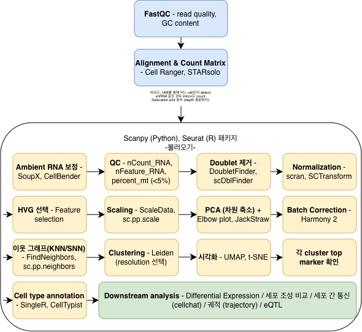

# jp_snRNA-seq_pipeline

단일핵 RNA 시퀀싱(snRNA-seq) 표준 분석 파이프라인 정리.

원시 FASTQ에서 세포 유형 주석까지, **각 단계가 무엇을 왜 하는지**와 **어떤 도구를 쓰는지**를 한곳에 모았습니다.
특정 논문 재현이 아니라 **일반적으로 적용되는 순서**를 기준으로 합니다.

---

## 전체 흐름



---

## 단계별 정리

### 0. 시퀀싱 품질 · 정렬

| 단계 | 하는 일 | 도구 |
|---|---|---|
| **FastQC** | 리드 품질, GC 함량 확인 | FastQC |
| **정렬 + 카운트 행렬** | 바코드·UMI로 어느 핵인지 구분하고 "핵 × 유전자 = 카운트" 표 생성 | Cell Ranger, STARsolo |

**snRNA에서 반드시 확인할 것**

- **인트론을 포함해야 합니다** (`--include-introns`). 핵 안 RNA는 아직 스플라이싱 전이라, 인트론을 빼면 상당량이 버려집니다.
- **Saturation plot**으로 시퀀싱 깊이가 충분한지 봅니다.

### 1. 잡음 제거

| 단계 | 하는 일 | 도구 |
|---|---|---|
| **Ambient RNA 보정** | 터진 세포에서 나와 액체에 떠다니는 RNA가 다른 방울에 섞인 것을 통계로 뺍니다 | SoupX, CellBender |
| **세포 QC** | 빈 방울·찢어진 핵·손상된 핵을 거릅니다 | `nCount_RNA`, `nFeature_RNA`, `percent_mt` |
| **유전자 필터** | 거의 검출되지 않는 유전자를 뺍니다 | 예: 3개 미만 세포에서만 검출 |
| **Doublet 제거** | 한 방울에 핵이 둘 들어간 것을 찾아 버립니다 | DoubletFinder, scDblFinder |

> **⚠️ Ambient 보정의 입력은 `raw`(필터 전) 행렬입니다.**
> CellBender·SoupX는 **빈 방울을 봐야** 배경 RNA 분포를 배웁니다.
> Cell Ranger의 `filtered` 출력만 있으면 이 단계를 돌릴 수 없습니다.

> **⚠️ `percent_mt` 기준은 scRNA와 다릅니다.**
> 미토콘드리아는 세포질에 있고 핵 안에는 없습니다. **snRNA에서는 거의 0이어야 정상**이고,
> 높게 나오면 세포질 오염을 뜻합니다. scRNA의 5~10% 기준을 그대로 쓰면 안 됩니다.

> **⚠️ Doublet 제거가 보통 가장 크게 자르는 필터입니다.** 파라미터를 반드시 기록하세요.

### 2. 정규화 · 특징 선택

| 단계 | 하는 일 | 도구 |
|---|---|---|
| **정규화** | 핵마다 읽힌 총량이 달라, "같은 깊이로 읽었다면"의 값으로 맞춥니다 | scran, SCTransform |
| **HVG 선택** | 세포 간 변이가 큰 유전자만 골라 신호 대 잡음비를 올립니다 | 보통 2,000개 |
| **Scaling** | 유전자별 분산을 맞추고, 원치 않는 변동(`nCount`, `percent_mt`)을 회귀로 뺍니다 | `ScaleData`, `sc.pp.scale` |

### 3. 차원 축소 · 배치 보정

| 단계 | 하는 일 | 도구 |
|---|---|---|
| **PCA** | 수천 차원을 수십 차원으로 줄입니다. 몇 개를 쓸지는 Elbow plot / JackStraw로 | `RunPCA`, `sc.tl.pca` |
| **배치 보정** | 샘플·환자·실험일 차이를 지웁니다 | Harmony, LIGER, Combat |

> **⚠️ 배치 보정 도구는 들어가는 자리가 서로 다릅니다.**
>
> | 도구 | 무엇을 고치나 | 자리 |
> |---|---|---|
> | **Combat** | 발현 행렬 자체 | **PCA 앞** |
> | **Harmony** | PCA 결과(좌표) | **PCA 뒤** |
> | **LIGER (iNMF)** | **PCA를 대체** (차원축소와 정렬을 동시에) | PCA 자리 |
>
> LIGER를 쓰면 파이프라인에서 **PCA 박스가 사라집니다.**

> **⚠️ 배치 보정은 이웃 그래프보다 먼저 와야 합니다.**
> 보정 전 좌표로 이웃을 정하면 배치 효과가 클러스터에 그대로 남습니다.

### 4. 군집화 · 주석

| 단계 | 하는 일 | 도구 |
|---|---|---|
| **이웃 그래프 (KNN/SNN)** | 각 핵의 가까운 이웃을 찾아 그래프를 만듭니다 | `FindNeighbors`, `sc.pp.neighbors` |
| **클러스터링** | 그래프에서 조밀한 덩어리를 찾습니다. 해상도가 높을수록 잘게 나뉩니다 | Leiden, Louvain |
| **시각화** | 2차원으로 펼쳐 봅니다 | UMAP, t-SNE |
| **마커 확인** | 클러스터마다 특징 유전자를 뽑습니다 | `FindAllMarkers`, `rank_genes_groups` |
| **세포 유형 주석** | 마커를 보고 이름을 붙입니다 | 수동, SingleR, CellTypist, Azimuth |

> 클러스터링과 시각화는 **둘 다 같은 임베딩(보정된 PCA 등)에서 나옵니다.**
> UMAP은 클러스터링 결과물이 아니라 **점검용 그림**입니다. UMAP 위의 거리를 해석하지 마세요.

> **해상도는 하나로 정해서 쓰지 말고 여러 값을 훑어보세요.** `clustree`로 세포가 어디서 갈라지는지 보면 고르기 쉽습니다.

### 5. 이후 분석

| 갈래 | 내용 |
|---|---|
| **차등 발현** | 집단·조건 간 발현 차이 |
| **세포 조성 비교** | 조건에 따라 세포 유형 비율이 달라지는가 |
| **세포 간 통신** | 리간드-수용체 신호 추정 (CellChat) |
| **궤적 분석** | 세포 상태 변화 경로 |
| **eQTL** | 유전형과 발현을 짝지어 조절 변이 탐색 |

---

## snRNA vs scRNA — 다른 점 세 가지

| | scRNA-seq | **snRNA-seq** |
|---|---|---|
| **`percent_mt`** | 5~10% 미만으로 거름 | **거의 0이어야 정상** |
| **인트론** | 보통 제외 | **반드시 포함** |
| **Ambient RNA** | 있음 | **더 심함** — 조직 해리 과정에서 터진 세포가 많음 |

**왜 핵만 뽑나** — 냉동 조직에서도 핵은 멀쩡하고, 지방이 많거나 큰 세포(간세포 등)는 통째로 분리하면 잘 깨집니다.

---

## 실제 적용 사례

이 파이프라인을 **실제 논문에 적용해 원시 데이터부터 재현한 기록**이 있습니다.

→ [MASLD_snRNA_pipeline](https://github.com/andrew010417/MASLD_snRNA_pipeline)
Hong et al., *Nature Genetics* 2025 — 간 조직 48명 snRNA-seq

거기서는 이 파이프라인의 **PCA 자리에 LIGER iNMF**가 들어가고,
**재현이 어디서 막히는지**(CellBender, Doublet 파라미터)가 수치로 기록돼 있습니다.

---

## 쓰는 법

### 1. 설치

```bash
Rscript envs/install.R
```
자세한 내용은 [envs/README.md](envs/README.md)

### 2. 데이터 놓기

샘플 하나당 폴더 하나입니다. Cell Ranger 출력을 그대로 넣으면 됩니다.

```
data/raw/
├── SAMPLE_A/
│   ├── barcodes.tsv.gz
│   ├── features.tsv.gz
│   └── matrix.mtx.gz
└── SAMPLE_B/ ...
```

### 3. 설정 고치기

`config/config.yaml` **하나만** 고치면 됩니다. 코드는 건드리지 않습니다.

```yaml
qc:
  min_features: 200
  max_percent_mt: 5        # snRNA는 거의 0이어야 정상
batch:
  method: "harmony"        # harmony | rpca | none
cluster:
  select: 0.4              # 최종 해상도
```

### 4. 실행

```bash
bash scripts/run_all.sh
```

단계별로 돌리려면:

```bash
Rscript scripts/01_load_qc.R
Rscript scripts/02_doublet.R            # 또는 샘플 하나만: 02_doublet.R SAMPLE_A
Rscript scripts/03_filter.R
...
```

**각 단계는 체크포인트를 남깁니다.** 중간에 멈춰도 다시 실행하면 이어서 갑니다.
다시 계산하려면 해당 `run/rds/*.rds` 파일을 지우세요.

### 5. 결과

```
run/
├── qc/         qc_metrics.tsv · doublet_rates.tsv · qc_cascade.tsv
├── figures/    qc_violin · elbow · clustree · umap_clusters · umap_batch · marker_dotplot
├── tables/     hvg.txt · cluster_by_sample.tsv · markers_all.tsv · markers_top.tsv
├── rds/        단계별 체크포인트
└── logs/
```

마지막에 `tables/markers_top.tsv` 를 보고 클러스터마다 세포 유형 이름을 붙이면 됩니다.

---

## 스크립트

| 파일 | 하는 일 |
|---|---|
| `00_common.R` | 설정 읽기 · 경로 · 체크포인트 · 10x 더블렛 비율표 |
| `01_load_qc.R` | 10x 행렬 읽기 → Seurat 객체 → QC 지표·그림 |
| `02_doublet.R` | DoubletFinder (`pK` 자동 탐색, 기대 비율은 10x 로딩표에서) |
| `03_filter.R` | 더블렛·핵 QC·미토 필터 → 유전자 필터 → 합치기 |
| `04_normalize.R` | scran size factor + batchelor, 또는 LogNormalize |
| `05_hvg_scale_pca.R` | HVG → Scaling → PCA (+ Elbow plot) |
| `06_integrate.R` | 배치 보정 (harmony / rpca / none) |
| `07_cluster.R` | 이웃 그래프 → 클러스터링 → UMAP (+ clustree) |
| `08_markers.R` | 클러스터별 마커 + dot plot |
| `run_all.sh` | 전 단계 순서대로 |

### 설계 원칙

- **설정과 코드를 분리합니다.** 파라미터는 전부 `config/config.yaml` 에 있습니다.
- **각 단계가 체크포인트를 남깁니다.** 비싼 계산을 두 번 하지 않습니다.
- **그림이 실패해도 멈추지 않습니다.** 패키지 버전 충돌로 그림 한 장을 못 그려도 계산 결과를 잃지 않습니다.
- **모든 핵이 걸러지면 이유를 알려주고 멈춥니다.** 어떤 기준이 문제였는지, 이 샘플 중앙값은 얼마인지 함께 출력합니다.

---

## 동작 확인

가짜 데이터로 파이프라인이 끝까지 도는지 확인할 수 있습니다.

```bash
Rscript tests/make_toy_data.R data/raw 3 300 400   # 샘플 3개 x 세포 300개 x 유전자 400개
bash scripts/run_all.sh
```

가짜 데이터는 **배선 점검용**입니다. 생물학적 의미는 없습니다.
작게 만들었으므로 `config/config.yaml` 에서 `min_features`·`n_hvg`·`n_pcs` 를 낮춰 주세요.

**검증 기록**: R 4.4.3 · Seurat 5.5.1 환경에서 위 가짜 데이터로 **8단계 전부 통과**했습니다
(`batch.method: rpca`, 약 2분). `clustree` 그림 한 장만 ggplot2 4.x 충돌로 건너뛰었습니다.

---

작성: 박재형 (BioNexus) · 2026-09
